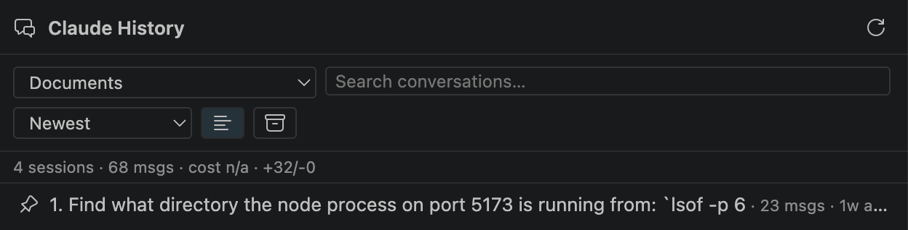
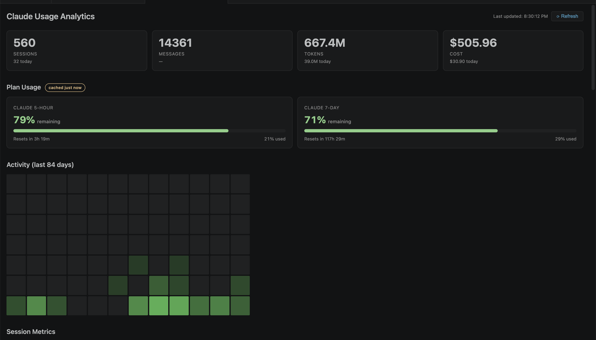
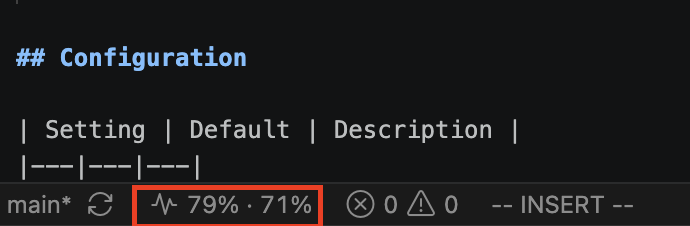

# Claude Code History Viewer

Browse, search, inspect, and resume your Claude Code conversations — directly inside VS Code.

- **Active sidebar** shows all your Claude Code sessions grouped by project, with rich metadata
- **Session metadata cards** — message count, files modified, cost (when available), +/- lines changed
- **Sorting** — by date, message count, or recent activity; pinned sessions float to the top
- **Project filtering** — scope the list to your current VS Code workspace or browse all projects
- **Compact mode** — toggle between full metadata and a minimal title+timestamp view
- **Archive + Pin** — archive old sessions out of sight; pin favorites to the top. Both persist across restarts.
- **Full conversation viewer** with Markdown, syntax highlighting, and collapsible tool calls/outputs
- **Full-text search** across all indexed conversations

- **File change inspector** — see every file touched during a session, with native VS Code diffs
- **One-click resume** — copy, run, or prefill `claude --resume` commands
- **Analytics dashboard** — active hours, weekly distribution, top modified files, and usage trends

- **Quota status bar** — track plan usage and reset windows at a glance

## Design

- **Local-first** — all data stays on your machine. No cloud backend, no sync, no API calls.
- **Privacy-first** — no telemetry, no analytics, no accounts, no payment.
- **Claude Code only** — built specifically for Claude Code's session format.

## Quick Start

1. Click the **Claude History** icon in the Activity Bar.
2. The extension discovers your sessions under `~/.claude/projects/` automatically.
3. Click any session to view it; use the search icon in the Search view to search across
   all conversations.

## Configuration

| Setting | Default | Description |
|---|---|---|
| `claudeHistory.claudeDirPath` | `""` | Path to Claude directory. Leave empty for `~/.claude`. |
| `claudeHistory.enableSearchIndexing` | `true` | Build and maintain the full-text search index. |
| `claudeHistory.maxIndexedFileSizeMB` | `50` | Skip indexing session files larger than this. |
| `claudeHistory.autoRefreshInterval` | `0` | Fallback polling interval (seconds). `0` = off. The file watcher handles live detection. |
| `claudeHistory.inheritTheme` | `true` | Conversation viewer follows the VS Code color theme. |
| `claudeHistory.defaultSort` | `"newest"` | Default sort order: newest, oldest, messages, activity. |
| `claudeHistory.defaultDisplayMode` | `"expanded"` | Default display density: expanded or compact. |
| `claudeHistory.showArchivedByDefault` | `false` | Show archived sessions in the list by default. |

## Feedback & Support

Found a bug or have a feature request? Use the **Feedback** button in the sidebar, or open an issue directly:
[github.com/fatihozdil/claude-code-history-viewer-analytics/issues](https://github.com/fatihozdil/claude-code-history-viewer-analytics/issues)

## Support

If this extension is useful to you, consider buying me a coffee:

## Documentation

More details: [USAGE.md](./USAGE.md) and [PRIVACY.md](./PRIVACY.md).

